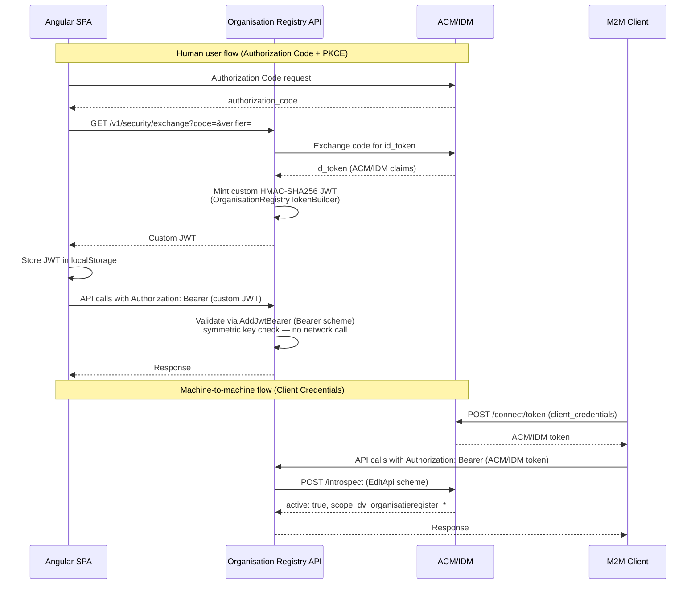
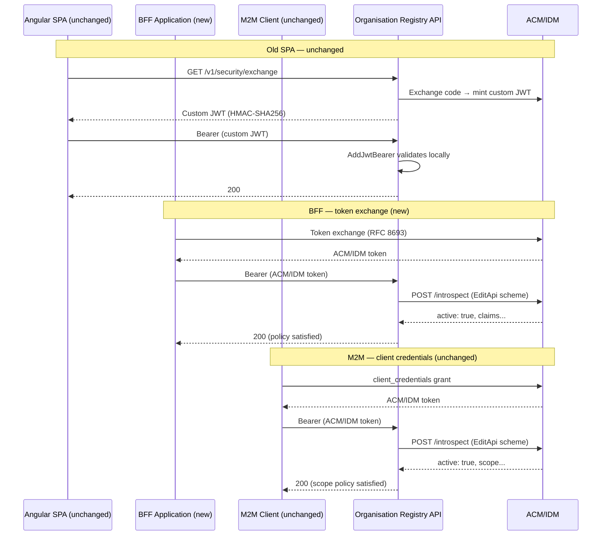
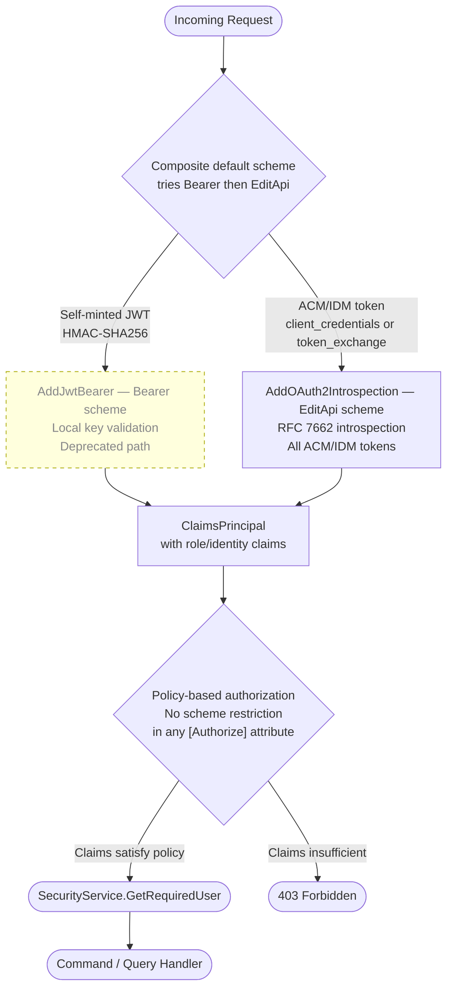
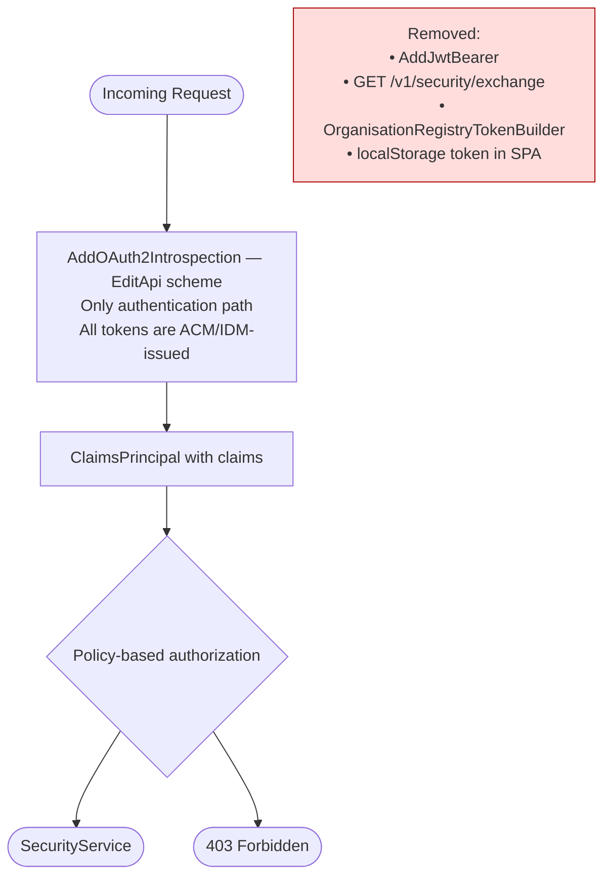

# Feature Specification: Authentication Rework — Multi-Method Support with Migration Path

**Feature Branch**: `002-auth-rework`
**Created**: 2026-03-23
**Status**: Draft
**Input**: User description: "we need to rework authentication. Right now we have a self-built authentication token we create after authorization code flow completes, and pass that over to the spa client. On the other hand, we have client credential grant flow for machine 2 machine communication. In the future, we'll have a BFF talking to us, instead of an spa application, which will use token exchange before sending their token to us. We want to migrate away from the self-built token, to only having client credential grant and supporting token exchange. So the backend api only validates the incoming tokens. For now though, we want a temporary solution that supports all 3 authentication methods. One of the issues we'll have to face is that authorization is sometimes based on Authentication Scheme. We'll probably want to migrate everything to policies."

## Clarifications

### Session 2026-03-23

- Q: Does token exchange use the same validation mechanism as client credentials? → A: Yes. Both produce ACM/IDM-issued tokens validated via the existing `AddOAuth2Introspection` (`EditApi` scheme). No new authentication scheme registration is needed.
- Q: What goes away in the end state? → A: `AddJwtBearer` — the self-minted HMAC-SHA256 JWT scheme. The `EditApi` introspection scheme stays and becomes the only authentication path.
- Q: What is the migration path? → A: Step 1 (this feature): support all three token types simultaneously; migrate authorization from scheme-based to policy-based. Step 2 (far future): remove `AddJwtBearer` once the old SPA is decommissioned.
- Q: Does the old SPA need any changes? → A: No. `AddJwtBearer` and `GET /v1/security/exchange` stay intact throughout this feature.

---

## Architecture: As-Is



```mermaid
flowchart TD
    Request([Incoming Request]) --> DefaultScheme{Default scheme:\nBearer}

    DefaultScheme -->|[OrganisationRegistryAuthorize]\nscheme hardcoded to Bearer| JwtBearer["AddJwtBearer — Bearer scheme\nHMAC-SHA256 symmetric key\nValidates self-minted JWT only"]

    DefaultScheme -->|[Authorize AuthenticationSchemes=EditApi]\nscheme hardcoded to EditApi| Introspection["AddOAuth2Introspection — EditApi scheme\nRFC 7662 network call to ACM/IDM\nValidates ACM/IDM-issued tokens"]

    JwtBearer --> BearerPrincipal["ClaimsPrincipal\nClaimTypes.Role = algemeenBeheerder etc\nvo_id, ovo-number"]
    Introspection --> EditApiPrincipal["ClaimsPrincipal\nscope = dv_organisatieregister_*"]

    BearerPrincipal --> Backoffice["~130 Backoffice controllers\n[OrganisationRegistryAuthorize]\nRole-based checks"]
    EditApiPrincipal --> EditApi["5 Edit API controllers\nScope policy checks"]

    Backoffice --> SecurityService([SecurityService.GetRequiredUser])
    EditApi --> SecurityService

    style JwtBearer fill:#ffd,stroke:#aa0
    style Introspection fill:#dfd,stroke:#0a0
```

**The problem**: `[OrganisationRegistryAuthorize]` hardcodes `AuthenticationSchemes = "Bearer"`. The 5 Edit API controllers hardcode `AuthenticationSchemes = "EditApi"`. A BFF token exchange token arrives via the `EditApi` (introspection) path but cannot reach backoffice endpoints because they demand the `Bearer` scheme.

---

## Architecture: Transition State (this feature)

All three token types work simultaneously. Authorization is policy-based only — no scheme restrictions in attributes.





---

## Architecture: Target State (Step 3 — far future, out of scope)



---

## User Scenarios & Testing *(mandatory)*

### User Story 1 — Existing SPA Users Continue Working Without Changes (Priority: P1)

As a human user of the Angular SPA, I can still log in via ACM/IDM, receive a custom JWT, and use all backoffice features exactly as before. No SPA code changes, no behavioural change.

**Why this priority**: The SPA is the primary user-facing interface. Any regression here is immediately visible and blocks all users.

**Independent Test**: Log in via SPA, navigate backoffice, perform a write operation. All succeed with zero SPA code changes.

**Acceptance Scenarios**:

1. **Given** a valid custom JWT (self-minted, `Bearer` scheme), **When** sent as `Authorization: Bearer` to any backoffice endpoint, **Then** the API returns the same response as before this change.
2. **Given** `GET /v1/security/exchange` called with a valid code and PKCE verifier, **When** invoked, **Then** it returns a valid custom JWT as before.
3. **Given** no token, **When** a protected endpoint is called, **Then** the API returns 401.

---

### User Story 2 — Machine Clients Continue Working Without Changes (Priority: P1)

As a M2M client (`cjmClient`, `orafinClient`), I can still obtain a client credentials token from ACM/IDM and call Edit API endpoints with the same authorization behaviour as before.

**Why this priority**: M2M integrations run automated data synchronization. Breaking them causes silent data integrity failures.

**Independent Test**: A machine client obtains a client credentials token and calls all five Edit API endpoints. Behaviour is identical to before this change.

**Acceptance Scenarios**:

1. **Given** a valid client credentials token with `dv_organisatieregister_cjmbeheerder` scope, **When** calling an Edit API endpoint requiring that scope, **Then** the API returns 200.
2. **Given** a token with insufficient scope, **When** calling a restricted endpoint, **Then** the API returns 403.
3. **Given** an invalid or expired token, **When** calling any endpoint, **Then** the API returns 401.

---

### User Story 3 — BFF Token Exchange Tokens Are Accepted (Priority: P2)

As a BFF application, I obtain a token via token exchange from ACM/IDM and call the API. The API validates it via the existing `EditApi` introspection scheme — the same path as client credentials — and authorizes based on the token's claims.

**Why this priority**: This is the primary new capability — the enabling step for the BFF migration path.

**Independent Test**: A token exchange token, obtained from the local ACM/IDM test instance using an RFC 8693 token exchange request, is accepted on any endpoint whose policy its claims satisfy. This is independently demonstrable using the existing local identity server without a full BFF implementation.

**Acceptance Scenarios**:

1. **Given** a valid token exchange token introspected via the `EditApi` scheme, **When** calling a backoffice endpoint whose policy the token's claims satisfy, **Then** the API returns 200.
2. **Given** a token exchange token whose claims do not satisfy the required policy, **When** calling a restricted endpoint, **Then** the API returns 403.
3. **Given** an invalid or revoked token exchange token, **When** calling any endpoint, **Then** the API returns 401.

---

### User Story 4 — Authorization Is Scheme-Agnostic (Priority: P2)

As a developer, authorization on any endpoint is expressed purely as a policy (claims requirement), not as a scheme restriction. Any valid token — regardless of which scheme validated it — is subject only to policy evaluation.

**Why this priority**: Without this, a BFF token exchange token (validated via `EditApi` scheme) can never reach a backoffice endpoint (which requires `Bearer` scheme). This is the direct enabler for User Story 3.

**Independent Test**: A token validated via `EditApi` scheme can call a backoffice endpoint if its claims satisfy that endpoint's policy. No `AuthenticationSchemes` string literal appears in any `[Authorize]` or `[OrganisationRegistryAuthorize]` attribute.

**Acceptance Scenarios**:

1. **Given** `[OrganisationRegistryAuthorize]` applied to a controller, **When** a request arrives authenticated via any registered scheme, **Then** authorization is determined solely by claims satisfying the policy.
2. **Given** the scope-checking policies on Edit API controllers, **When** the `AuthenticationSchemes = EditApi` restriction is removed, **Then** the policies still correctly grant/deny access based on scope claims alone.
3. **Given** a new endpoint added in the future, **When** a developer applies `[OrganisationRegistryAuthorize]`, **Then** no scheme name is required.

---

### Edge Cases

- **`SecurityService.GetRequiredUser()` for token exchange tokens**: Currently branches on specific scope claim values for M2M clients. Token exchange tokens may carry both user identity claims and scope claims — resolution must be unambiguous.
- **`GET /v1/security` for BFF tokens**: Returns `SecurityInfo` for the SPA's role cache. Behaviour for BFF tokens must be defined: does it return security info based on the token's claims, or is it explicitly SPA-only?
- **Default scheme and multi-scheme try**: Once `[Authorize]` has no `AuthenticationSchemes`, ASP.NET Core only tries the `DefaultAuthenticateScheme` (`Bearer`). A composite/forwarding scheme is needed so both `Bearer` and `EditApi` are attempted per request.
- **`ConfigureClaimsPrincipalSelectorMiddleware`**: Tries `Bearer` first, then `EditApi`. Order must be preserved correctly.
- **Expired / revoked token**: JWT expiry (local) vs introspection `active: false` (network). Both must return 401.

---

## Requirements *(mandatory)*

### Functional Requirements

- **FR-001**: The API MUST continue to accept and validate the existing self-minted HMAC-SHA256 JWT (`Bearer` scheme) for backward compatibility with the existing SPA.
- **FR-002**: The API MUST continue to accept and validate ACM/IDM client credentials tokens via `AddOAuth2Introspection` (`EditApi` scheme), unchanged.
- **FR-003**: The API MUST accept ACM/IDM token exchange tokens via the existing `EditApi` introspection scheme — no new scheme registration is required.
- **FR-004**: `GET /v1/security/exchange` and `OrganisationRegistryTokenBuilder` MUST remain entirely unchanged.
- **FR-005**: Authorization MUST evaluate based on claims only, regardless of which scheme validated the token.
- **FR-006**: `[OrganisationRegistryAuthorize]` MUST NOT hardcode `AuthenticationSchemes = "Bearer"`. All registered schemes must be eligible.
- **FR-007**: Edit API controllers MUST NOT hardcode `AuthenticationSchemes = AuthenticationSchemes.EditApi`. Scope policies alone enforce access.
- **FR-008**: The existing scope-checking policies (`BANKACCOUNTS`, `ORGANISATIONS`, `KEYS`, `ORGANISATIONCLASSIFICATIONS`, `ORGANISATIONCONTACTS`) MUST remain functionally equivalent — claim values checked are unchanged.
- **FR-009**: `SecurityService.GetRequiredUser()` MUST correctly resolve an `IUser` for tokens from both schemes, including token exchange tokens.
- **FR-010**: `ConfigureClaimsPrincipalSelectorMiddleware` MUST correctly build a `ClaimsPrincipal` for tokens from both schemes.
- **FR-011**: The default authentication scheme configuration MUST be updated so that `[Authorize]` without an explicit `AuthenticationSchemes` tries both `Bearer` and `EditApi`.

### Non-Functional Requirements

- **NFR-001**: Authentication failures MUST return 401; authorization failures MUST return 403 — consistent across both schemes.
- **NFR-002**: Zero changes to existing SPA client code (`OrganisationRegistry.UI/`) or M2M client configurations.
- **NFR-003**: No new NuGet packages. No new authentication scheme registrations.
- **NFR-004**: Adding future authentication schemes MUST NOT require changes to individual controller `[Authorize]` attributes.
- **NFR-005**: All new and modified authorization paths MUST be covered by integration tests demonstrating 200/401/403 for each relevant scenario.

### Key Entities

- **`Bearer` scheme** (`AddJwtBearer`): Validates self-minted HMAC-SHA256 JWTs. Deprecated path; removed in Step 3.
- **`EditApi` scheme** (`AddOAuth2Introspection`): Validates all ACM/IDM-issued tokens (client credentials and token exchange) via RFC 7662 introspection. The future-state single authentication path.
- **`[OrganisationRegistryAuthorize]`**: Custom `AuthorizeAttribute` — to be made scheme-agnostic.
- **`SecurityService.GetRequiredUser()`**: Resolves `IUser` from `ClaimsPrincipal` — must handle all token types.
- **`OrganisationRegistryTokenBuilder`**: Mints custom JWT for the SPA. Unchanged; deprecated alongside `AddJwtBearer`.

## Success Criteria *(mandatory)*

### Measurable Outcomes

- **SC-001**: All existing SPA-facing integration tests pass without modification — zero regressions.
- **SC-002**: All existing M2M integration tests pass without modification — zero regressions.
- **SC-003**: A token exchange token is accepted on a backoffice endpoint whose policy it satisfies, and correctly rejected (403/401) where it does not.
- **SC-004**: No `AuthenticationSchemes = "Bearer"` in `[OrganisationRegistryAuthorize]`; no `AuthenticationSchemes = "EditApi"` in Edit API controller `[Authorize]` attributes.
- **SC-005**: `SecurityService.GetRequiredUser()` returns a non-null `IUser` for tokens from both schemes in integration tests.
- **SC-006**: Integration tests cover the token exchange path: 200 (authorized), 403 (insufficient claims), 401 (invalid token).
