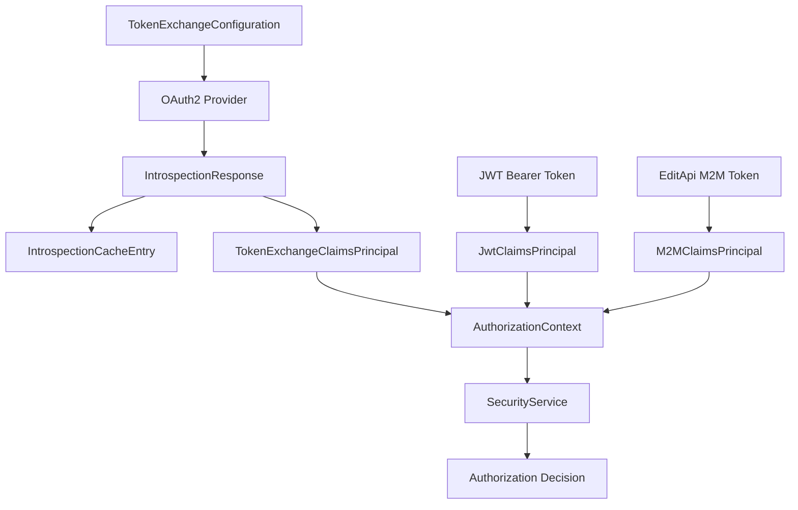

# Data Model: External Token Authentication

**Feature**: External Token Authentication  
**Date**: April 24, 2026  
**Purpose**: Define entities, relationships, and data structures for OAuth2 token introspection authentication

## Core Entities

### TokenExchangeConfiguration
Configuration entity for third-party token exchange providers.

**Fields**:
- `Authority` (string): OAuth2 provider authority URL
- `IntrospectionEndpoint` (string): RFC 7662 introspection endpoint URL  
- `ClientId` (string): OAuth2 client identifier for introspection
- `ClientSecret` (string, sensitive): OAuth2 client secret for introspection
- `CacheTtl` (TimeSpan): Time-to-live for cached introspection results (default: 2 minutes)
- `Enabled` (bool): Feature flag to enable/disable provider (default: false)

**Validation Rules**:
- Authority must be valid HTTPS URL
- IntrospectionEndpoint must be valid HTTPS URL
- ClientId required and non-empty
- ClientSecret required for non-development environments
- CacheTtl must be between 30 seconds and 30 minutes

**Relationships**: None (configuration-only entity)

### IntrospectionResponse
Represents parsed OAuth2 token introspection response.

**Fields**:
- `Active` (bool): Whether token is currently active
- `Scope` (string[]): Authorized scopes for the token
- `ClientId` (string): Client that owns the token
- `Username` (string): End-user username if present
- `TokenType` (string): Type of token (e.g., "Bearer")
- `ExpiresAt` (DateTimeOffset?): Token expiration timestamp
- `IssuedAt` (DateTimeOffset?): Token issuance timestamp
- `Subject` (string): Token subject (user identifier)
- `Audience` (string[]): Intended audience for the token
- `Issuer` (string): Token issuer identifier
- `JwtId` (string): Unique token identifier
- `VoId` (string?): Flemish government identifier (vo_id claim)
- `AdditionalClaims` (Dictionary<string, object>): Additional provider-specific claims

**Validation Rules**:
- Active must be true for authentication to succeed
- ExpiresAt must be in the future if present
- Subject required for user tokens
- VoId presence distinguishes user tokens from M2M tokens

**State Transitions**:
- Active: true → false (token revoked/expired)
- ExpiresAt: future → past (token expires)

### IntrospectionCacheEntry
Cached introspection result with metadata.

**Fields**:
- `TokenHash` (string): SHA256 hash of original token (cache key)
- `ProviderId` (string): Identifier of the introspection provider
- `Response` (IntrospectionResponse): Cached introspection response
- `CachedAt` (DateTimeOffset): When response was cached
- `ExpiresAt` (DateTimeOffset): Cache entry expiration (based on TTL)
- `HitCount` (int): Number of cache hits for metrics

**Validation Rules**:
- TokenHash must be valid SHA256 hash
- ExpiresAt must be after CachedAt
- HitCount must be non-negative

**Lifecycle**:
- Created: On first successful introspection
- Updated: On cache hit (HitCount increment)
- Expired: When current time > ExpiresAt
- Invalidated: On manual cache clear or configuration change

### TokenExchangeClaimsPrincipal
Enhanced claims principal for token exchange authentication.

**Fields**:
- `Identity` (ClaimsIdentity): Base claims identity
- `AuthenticationScheme` (string): Always "TokenExchange"
- `VoId` (string): Flemish government user identifier
- `Roles` (Role[]): Mapped authorization roles
- `Organizations` (string[]): Authorized organization OVO numbers
- `WegwijsRoles` (string[]): iv_wegwijs_rol_3D claim values
- `IsM2MClient` (bool): False for token exchange (always has VoId)
- `TokenType` (TokenType): TokenExchange enum value

**Validation Rules**:
- VoId required and must match vo_id claim pattern
- Roles must be valid Organization Registry roles
- Organizations must be valid OVO number format
- AuthenticationScheme must be "TokenExchange"

**Relationships**:
- Equivalent to JWT Bearer claims structure for authorization
- Distinct from M2M EditApi claims (no VoId, different roles)

### AuthorizationContext
Unified authorization context regardless of authentication method.

**Fields**:
- `User` (ClaimsPrincipal): Authenticated user principal
- `AuthenticationMethod` (AuthenticationMethod): JwtBearer | TokenExchange | EditApi
- `Roles` (Role[]): Normalized authorization roles
- `Organizations` (string[]): Authorized organizations
- `Permissions` (Permission[]): Computed permissions for request context
- `IsAuthenticated` (bool): Whether authentication succeeded
- `VoId` (string?): User identifier (null for M2M clients)

**Computed Properties**:
- `IsUserAuthentication`: VoId != null (JwtBearer or TokenExchange)
- `IsM2MAuthentication`: VoId == null (EditApi)
- `CanAccessOrganization(string ovoNumber)`: Organization-specific authorization
- `HasRole(Role role)`: Role-based authorization check

### AuthenticationScheme Enumeration
```csharp
public enum AuthenticationScheme
{
    JwtBearer,      // Self-minted JWT tokens
    TokenExchange,  // OAuth2 introspection for user tokens
    EditApi         // OAuth2 introspection for M2M tokens
}
```

### TokenType Enumeration  
```csharp
public enum TokenType
{
    SelfMintedJwt,  // JWT Bearer tokens
    IntrospectedUser, // Token exchange tokens with vo_id
    IntrospectedM2M   // M2M tokens without vo_id
}
```

## Data Relationships



## Content-Based Authorization Flow

1. **Token Reception**: HTTP request with Bearer token
2. **Scheme Detection**: Middleware determines authentication scheme
3. **Token Introspection**: OAuth2 introspection for TokenExchange/EditApi schemes
4. **Content Analysis**: Examine introspection response claims
5. **User Type Detection**: VoId presence → User token | VoId absence → M2M token
6. **Claims Mapping**: Map introspection claims to Organization Registry claims
7. **Authorization Context**: Create unified context for downstream authorization
8. **Permission Evaluation**: SecurityService evaluates permissions based on content

## Cache Data Flow

1. **Cache Key Generation**: SHA256(token) + ProviderId
2. **Cache Lookup**: Check for existing valid cache entry
3. **Cache Hit**: Return cached response, increment HitCount
4. **Cache Miss**: Perform introspection, cache result with TTL
5. **Cache Expiry**: Remove expired entries on next access
6. **Cache Invalidation**: Clear on configuration changes or manual trigger

## Validation and Business Rules

### Token Exchange Validation
- Token must be active in introspection response
- Must contain vo_id claim (distinguishes from M2M)
- Must have valid role claims (iv_wegwijs_rol_3D format)
- Must have authorized organization claims

### Cache Validation
- Cache TTL must respect security requirements (max 5 minutes)
- Cache entries expire before token expiration
- Cache invalidation on provider configuration changes

### Authorization Equivalence
- TokenExchange users must receive identical permissions to JWT Bearer users with same vo_id
- M2M clients must maintain existing authorization behavior
- No privilege escalation through authentication scheme changes

## Security Considerations

### Sensitive Data Handling
- TokenExchangeConfiguration.ClientSecret encrypted at rest
- Token values never cached (only introspection responses)
- Cache keys use SHA256 hash, not raw tokens
- Audit logging for all authentication decisions

### Performance Optimization
- Introspection caching reduces provider load 80-95%
- Async-first implementation for I/O-bound introspection calls
- Circuit breaker pattern for provider failures
- Configurable timeouts and retry policies

## Migration Strategy

### Phase 1: Infrastructure
- Deploy configuration and caching infrastructure
- Add TokenExchange authentication scheme (disabled)
- Implement content-based authorization middleware

### Phase 2: Testing
- Enable TokenExchange for test users only
- Validate authorization equivalence with JWT Bearer
- Performance and security testing

### Phase 3: Production Rollout
- Gradual enablement for broader user base
- Monitor authentication success rates and performance
- Prepare for eventual JWT Bearer deprecation (future)