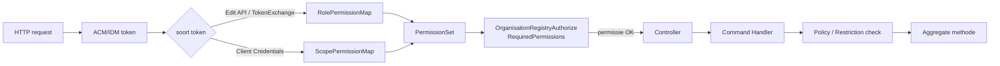

# Handoff 2026-09-02 — Wat we gisteren deden op 009 permission-based authz

> Voor: collega die bezig is/was met **controller-level authority**  
> Doel: in één oogopslag zien wat er is veranderd, waarom, en wat het voor jouw werk betekent.

---

## TL;DR

Gisteren hebben we de permissie-gebaseerde autorisatie **afgemaakt voor de Keys MVP** en alle test suites groen gekregen. De belangrijkste wijzigingen:

- `CanEditAll` is volledig verwijderd.
- Er is een nieuwe **restriction**-algebra ingevoerd (`AllowList`, `CompositeAnd`, `KeyContext`) — dit is de iteratie die we intern "Model C" noemen.
- Keys werken nu end-to-end via `CanManageKeys` + `KeyPolicy`.
- De Piavo import kreeg 403s op contacten; dat is gefixt door `CanAddContacts` toe te voegen.
- Controllers en handlers zijn aangepast aan het nieuwe model.
- Alle tests zijn groen.

| Suite | Resultaat |
|---|---|
| Unit tests | **838 passed / 9 skipped / 0 failed** |
| API integration tests | **112 passed / 30 skipped / 0 failed** |
| SQL Server integration tests | **32 passed / 0 failed** |
| KBO mutations unit tests | **27 passed / 0 failed** |
| ElasticSearch tests | **105 passed / 1 skipped / 0 failed** |

---

## Wat betekent "Model C"?

Dat is onze interne naam voor de iteratie van gisteren. We hebben drie varianten bekeken voor resource-level autorisatie:

- **Model A/B:** eenvoudige permissies zonder context (globaal ja/nee).
- **Model C:** permissies **met typed restrictions** — je hebt `CanManageKeys`, maar pas als je ook voldoet aan de context (bijv. organisatie onder Vlimpers-beheer + keytype staat op de allow-list).

Gisteren is Model C geïmplementeerd voor **keys**. De andere resources (bodies, labels, …) volgen later met hetzelfde pattern.

---

## Commits van gisteren (2026-09-02)

```
bc7f7a1c2 test: or-3296 align M2M key tests with permission model and fix bankaccount theory
394d84585 feat: or-3296 expose CanSelect and CanEdit alongside existing key permissions
100b5fc04 docs: or-3296 scrub stale CanEditAll retained claims from 009 spec
acae14c16 refactor: or-3296 remove CanEditAll super-permission
491c0ce41 fix: or-3296 grant CanAddContacts to admin roles and TestClient scope
121e923f6 docs: or-3296 align spec docs with model c keys mvp
c3b0d4af5 feat: or-3296 implement model c keys mvp end-to-end
cc7cba920 feat: or-3296 introduce restriction primitives
874d63d39 fix: or-3296 restore canmanagekeys for developer superrole
a3e168bbc docs: or-3296 add restrictions architecture and ui permission matrix
```

---

## Architectuur: hoe ziet het er nu uit?



**Belangrijk:** er zijn **twee lagen**:

1. **Controller/filter-laag**: checkt of je het juiste *permission* hebt (bijv. `CanManageKeys`). Dit is een globale gate.
2. **Handler/domain-laag**: checkt of dat permission ook *toepasbaar* is op deze specifieke context (bijv. Vlimpers-organisatie + allow-list keytype). Dat gebeurt via policies en restrictions.

---

## De nieuwe taal: PermissionSet, PermissionEntry en Restrictions

### PermissionEntry

Een grant is nu niet meer alleen "je mag X", maar "je mag X *mits* …".

```csharp
public sealed record PermissionEntry(
    Permission Permission,
    IRestriction? Restriction)
{
    public static implicit operator PermissionEntry(Permission permission)
        => new(permission, null);

    public bool IsRestricted => Restriction is not null;
}
```

- `Restriction == null` → onbeperkt grant (bijv. `AlgemeenBeheerder` mag altijd keys beheren).
- `Restriction != null` → beperkt grant (bijv. `VlimpersBeheerder` mag keys beheren, maar alleen voor Vlimpers-organisaties en alleen bepaalde keytypes).

### PermissionSet

Een immutable set van grants. De kernmethodes zijn:

```csharp
// Controller gate: heb ik überhaupt dit permission?
public bool Contains(Permission permission)
    => _entries.Any(e => e.Permission == permission);

// Handler gate: mag ik dit permission in deze specifieke context?
public bool IsSatisfiedFor(Permission permission, IRestrictionContext context)
    => _entries.Any(e =>
        e.Permission == permission &&
        (e.Restriction is null || e.Restriction.IsOkWith(context)));
```

Logica:

- OR over meerdere grants: één grant voor `CanManageKeys` dat matcht = toegestaan.
- Een **onbeperkt** grant "absorbeert" beperkte grants voor hetzelfde permission.
- Geen grant = fail-closed.

### Restrictions

Voorbeeld: een beperking die checkt of alle relevante IDs in een allow-list zitten.

```csharp
public sealed class AllowListRestriction<TContext>
    : IRestriction, IEquatable<AllowListRestriction<TContext>>
    where TContext : IRestrictionContext
{
    private readonly ImmutableHashSet<Guid> _allowed;

    public bool IsOkWith(IRestrictionContext context)
        => context is TContext typed && typed.RelevantIds.All(_allowed.Contains);
}
```

En een `CompositeAndRestriction` om meerdere beperkingen te combineren:

```csharp
public bool IsOkWith(IRestrictionContext context)
    => _restrictions.All(r => r.IsOkWith(context));
```

Voor keys is dat precies wat we nodig hebben: Vlimpers-managed organisatie **EN** keytype op de allow-list.

---

## RolePermissionMap: geen CanEditAll meer

`AlgemeenBeheerder` krijgt nu **elke permission expliciet** toegewezen. Geen super-permission.

```csharp
[Role.AlgemeenBeheerder] = PermissionSet.Of(
    Permission.CanEditChildren,
    Permission.CanAddBodies,
    Permission.CanEditBodies,
    Permission.CanRegisterBodies,
    Permission.CanAddLocations,
    Permission.CanAddContacts,          // <-- gisteren toegevoegd
    Permission.CanManageKeys,
    Permission.CanManageLabels,
    Permission.CanManageCapacities,
    Permission.CanManageFormalFrameworks,
    Permission.CanManageOrganisationClassifications,
    Permission.CanManageRegulations,
    Permission.CanImport,
    Permission.CanEditVlimpers,
    Permission.CanEditDelegations,
    Permission.CanReadConfiguration,
    Permission.CanEditOrganisationLabels),
```

`VlimpersBeheerder` krijgt een **beperkte** `CanManageKeys`:

```csharp
[Role.VlimpersBeheerder] = PermissionSet.Of(
    Permission.CanEditVlimpers,
    Permission.CanEditChildren,
    Permission.CanEditOrganisationLabels),

// Apart, config-afhankelijk:
Role.VlimpersBeheerder => PermissionSet.Of(
    Permission.CanManageKeys.RestrictedTo(
        KeyRestrictions.VlimpersManaged(
            configuration.Authorization.KeyIdsAllowedForVlimpers))),
```

---

## ScopePermissionMap: M2M scopes

Voor Client Credentials (machine-to-machine):

```csharp
[AcmIdmConstants.Scopes.CjmBeheerder] = PermissionSet.Of(
    Permission.CanAddBodies,
    Permission.CanEditBodies),

[AcmIdmConstants.Scopes.OrafinBeheerder] = PermissionSet.Of(
    Permission.CanReadOrafin),

[AcmIdmConstants.Scopes.TestClient] = PermissionSet.Of(
    Permission.CanEditChildren,
    Permission.CanAddBodies,
    // ... alle admin permissies, inclusief CanManageKeys
    Permission.CanManageKeys),
```

**Let op:** CJM en Orafin hebben **geen** `CanManageKeys`. Daarom falen de M2M key-tests nu met `400 BadRequest`.

---

## Controller-level gate

Het `[OrganisationRegistryAuthorize]` attribuut werkt nu met permissions:

```csharp
public class OrganisationRegistryAuthorizeAttribute : AuthorizeAttribute, IAsyncAuthorizationFilter
{
    [Obsolete("Role-based authorization is being replaced by permission-based authorization.")]
    public OrganisationRegistryAuthorizeAttribute(params Role[] roles) : this() { ... }

    public OrganisationRegistryAuthorizeAttribute()
    {
        Policy = PolicyNames.BackofficeUser;
    }

    public Permission[]? RequiredPermissions { get; set; }

    public async Task OnAuthorizationAsync(AuthorizationFilterContext context)
    {
        if (RequiredPermissions is null || RequiredPermissions.Length == 0)
            return;

        var securityService = context.HttpContext.RequestServices.GetService<ISecurityService>();
        var user = await securityService.GetRequiredUser(context.HttpContext.User);

        if (user.HasAnyPermission(RequiredPermissions))
            return;

        context.Result = new ForbidResult();
    }
}
```

Voorbeeld op een command controller:

```csharp
[OrganisationRegistryAuthorize(RequiredPermissions = new[] { Permission.CanManageKeys })]
public class OrganisationKeyCommandController : OrganisationRegistryController
```

**Jijwerk:** controllers converteren van role-based naar permission-based = `RequiredPermissions` zetten in plaats van roles.

---

## Domain-level gate: KeyPolicy

De controller checkt alleen of je `CanManageKeys` hebt. De handler checkt of je het ook **in deze context** mag gebruiken.

```csharp
public class KeyPolicy : ISecurityPolicy
{
    private readonly bool _isUnderVlimpersManagement;
    private readonly Guid[] _keyTypeIds;

    public KeyPolicy(bool isUnderVlimpersManagement, params Guid[] keyTypeIds)
    {
        _isUnderVlimpersManagement = isUnderVlimpersManagement;
        _keyTypeIds = keyTypeIds;
    }

    public AuthorizationResult Check(IUser user)
        => user.IsSatisfiedFor(
            Permission.CanManageKeys,
            new KeyContext(_isUnderVlimpersManagement, _keyTypeIds))
            ? AuthorizationResult.Success()
            : AuthorizationResult.Fail(InsufficientRights.CreateFor(this));

    public override string ToString()
        => "Geen machtiging op sleutel";
}
```

`KeyContext` bevat de twee assen waarop we checken:

- Is de organisatie onder Vlimpers-management?
- Welke keytype IDs zijn betrokken?

---

## Hoe gebruik je KeyPolicy in een handler?

```csharp
public Task Handle(ICommandEnvelope<AddOrganisationKey> envelope)
    => UpdateHandler<Organisation>.For(envelope.Command, envelope.User, Session)
        .WithKeyPolicy(envelope.Command)          // <- policy op command niveau
        .Handle(
            session =>
            {
                var organisation = session.Get<Organisation>(envelope.Command.OrganisationId);
                var keyType = session.Get<KeyType>(envelope.Command.KeyTypeId);

                organisation.AddKey(
                    envelope.Command.OrganisationKeyId,
                    keyType,
                    envelope.Command.KeyValue,
                    new Period(...),
                    keyTypeId => new KeyPolicy(
                        organisation.State.UnderVlimpersManagement,
                        keyTypeId).Check(envelope.User).IsSuccessful);
            });
```

`.WithKeyPolicy(envelope.Command)` is een shortcut die de policy opbouwt op basis van het command. De lambda binnen `AddKey` wordt gebruikt om per individueel keytype te checken (relevant voor bulk-operaties).

---

## Hoe gebruik je KeyPolicy in een read controller?

`OrganisationKeyController.Get` (lijst) bouwt een `Func<Guid, bool>` om per keytype te bepalen of de huidige gebruiker die mag zien/selecteren:

```csharp
var user = await securityService.GetUser(User);
Func<Guid, bool> isAuthorizedForKeyType = keyTypeId => new KeyPolicy(
        memoryCaches.UnderVlimpersManagement.Contains(organisationId),
        keyTypeId)
    .Check(user)
    .IsSuccessful;

var pagedOrganisations = new OrganisationKeyListQuery(
    context,
    organisationId,
    isAuthorizedForKeyType).Fetch(filtering, sorting, pagination);
```

En `KeyTypeController.Get` doet hetzelfde, maar optioneel voor een specifieke organisatie (`forOrganisationId`):

```csharp
Func<Guid, bool> isAuthorizedForKeyType = keyTypeId =>
    !forOrganisationId.HasValue ||
    new KeyPolicy(
            memoryCaches.UnderVlimpersManagement.Contains(forOrganisationId.Value),
            keyTypeId)
        .Check(user)
        .IsSuccessful;
```

**Jijwerk:** lees-controllers die UI-keuzelijsten tonen, moeten dit soort `isAuthorizedFor...` delegates meegeven aan hun queries zodat de frontend alleen toegestane items krijgt.

---

## API response uitbreiding

Voor de UI zijn er twee nieuwe velden bijgekomen (naast de oude, voor backward compatibility):

```csharp
// KeyTypeListQuery.cs
public class KeyTypeListItemResult
{
    public bool UserPermitted { get; }   // bestaand
    public bool CanSelect { get; }       // nieuw, zelfde waarde
}

// OrganisationKeyListQuery.cs
public class OrganisationKeyListQueryResult
{
    public bool IsEditable { get; }      // bestaand
    public bool CanEdit { get; }         // nieuw, zelfde waarde
}
```

---

## Testaanpassingen

### Keys: CJM en Orafin mogen niet meer

Oude test verwachtte `201 Created`. Nu verwachten we `400 BadRequest`.

```csharp
[EnvVarIgnoreTheory]
[InlineData(ApiFixture.Orafin.Client, ApiFixture.Orafin.Scope)]
[InlineData(ApiFixture.CJM.Client, ApiFixture.CJM.Scope)]
public async Task CannotCreateAndUpdateAs(string client, string scope)
{
    var organisationId = Guid.NewGuid();
    await _apiFixture.Create.Organisation(organisationId, TestOrganisationName);

    var httpClient = await _apiFixture.CreateMachine2MachineClientFor(client, scope);
    var response = await CreateKey(organisationId, httpClient, _orafinKeyType);

    await ApiFixture.VerifyStatusCode(response, HttpStatusCode.BadRequest);
}
```

### Bankaccounts: skip fix

`SkipBankAccountsAttribute` is `FactAttribute`-derived. Je kunt die niet combineren met `[InlineData]`. Opgelost met `[Theory(Skip = "...")]`:

```csharp
[Theory(Skip = "Skip Bankaccounts")]
[InlineData(Role.AlgemeenBeheerder)]
[InlineData(Role.CjmBeheerder)]
public async Task CanCreateAndUpdateAs(Role role) { ... }
```

---

## Belangrijke beslissingen

1. **Geen admin short-circuit.** `AlgemeenBeheerder` krijgt elk permission expliciet. Geen `CanEditAll`.
2. **Twee lagen.** Controller checkt permissions; handler checkt policies/restricties.
3. **CJM / Orafin zijn bewust beperkt.** Krijgen geen `CanManageKeys`.
4. **Vlimpers blijft een restrictie, geen rol.** `RequireUnderVlimpersManagementRestriction` checkt of organisatie Vlimpers-managed is.
5. **Backward compatibility.** `UserPermitted`/`IsEditable` blijven bestaan; `CanSelect`/`CanEdit` zijn toegevoegd.
6. **Piavo import fix.** `CanAddContacts` toegevoegd aan admin roles en `TestClient` scope, zodat de import contacten kan aanmaken.

---

## Gotchas

- `OrganisationRegistryAuthorizeAttribute` checkt **permissions**, geen rollen. Een rol die niet in `RolePermissionMap` staat → `PermissionSet.Empty` → 403.
- `BeheerderForOrganisationRegardlessOfVlimpersPolicy` gebruikt nog een role-check (`AlgemeenBeheerder`/`CjmBeheerder`). Dat is een domeinregel, niet de mapping-laag.
- Re-run import via `tilt trigger piavo-import`, niet via `kubectl apply` (ImagePullBackOff).
- Nieuwe `.md` files worden geblokkeerd door de write-hook; gebruik `cat > file.md << 'EOF'` in bash of voeg toe aan bestaande docs.

---

## Next steps

- [ ] Code review van de 9 commits op `009-permission-based-authz`.
- [ ] Branch pushen wanneer de teamafspraak dat toelaat.
- [ ] CI in de gaten houden; lokaal is alles groen.
- [ ] Jouw werk: verder converteren van controllers naar `RequiredPermissions` (T026b Search, T026c overige).
- [ ] Volgende verticale slice: Model D of verdere controller-conversies.

