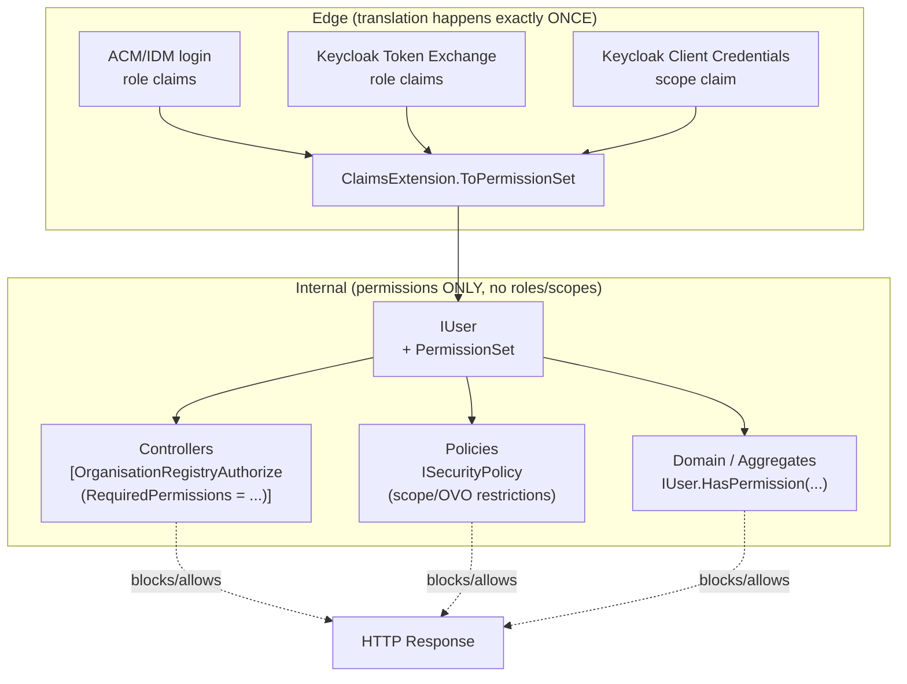
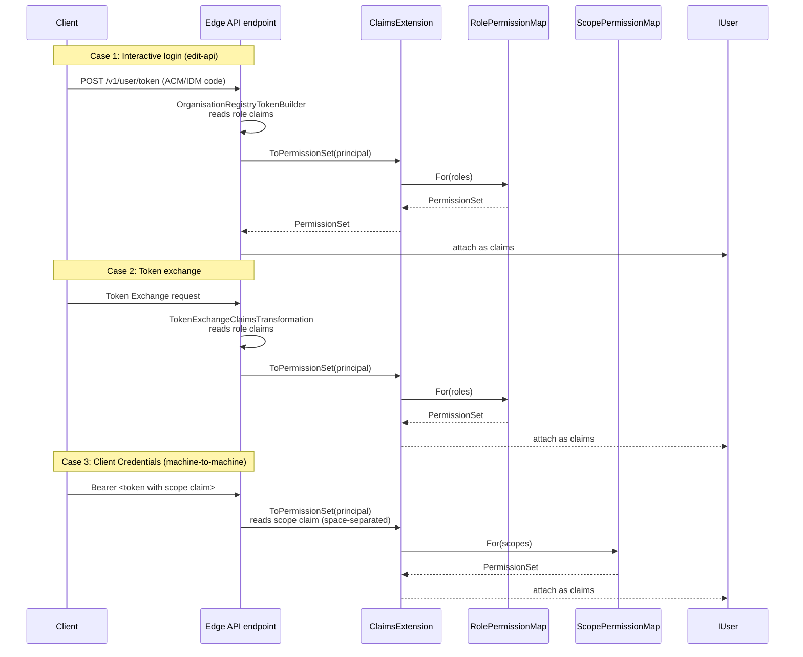
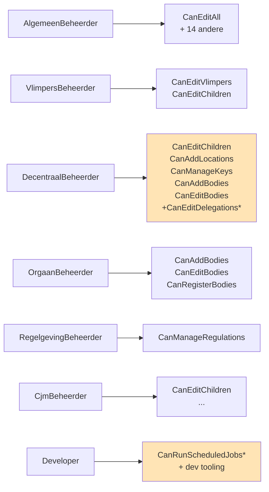
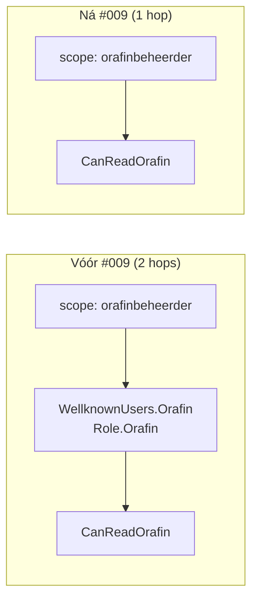
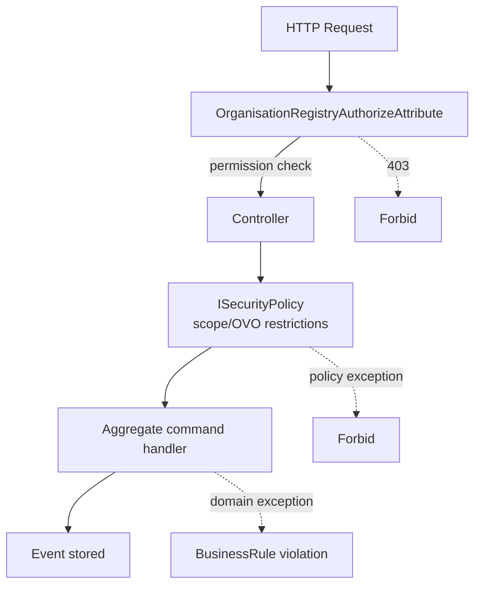
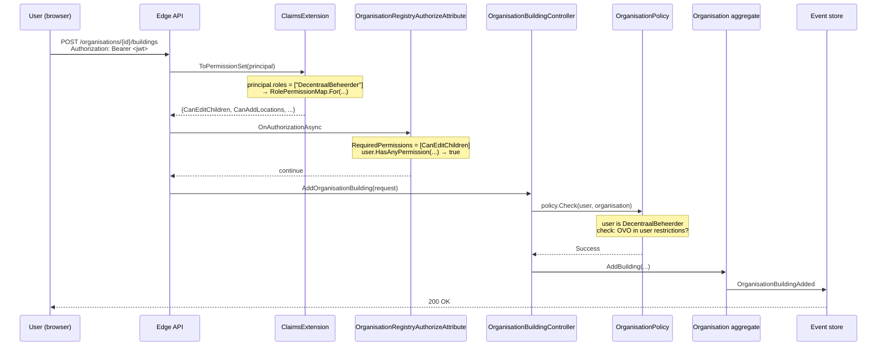
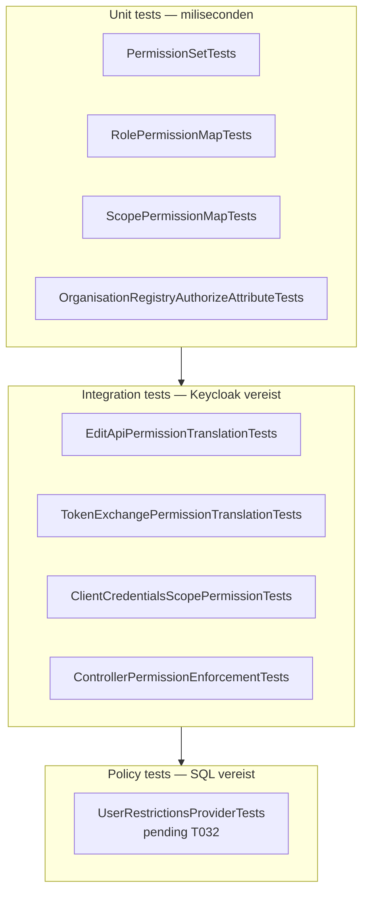

# Security Architecture — Permission-Based Authorization

**Feature:** 009-permission-based-authz
**Status:** In Progress (US1 klaar, US2/US3 pending)
**Audience:** Developers, reviewers, integrators

---

## 1. TL;DR

De organisation-registry stapt af van **rol-gebaseerde** autorisatie in de codebase en gebruikt intern nog uitsluitend **permissions**. Rollen (interactieve gebruikers via ACM/IDM) en scopes (Client Credentials via Keycloak) worden **eenmalig aan de rand** vertaald naar een `PermissionSet`. Vanaf dat moment kent de rest van de applicatie geen rollen of scope-strings meer — alleen `Permission` enum-waarden.

**Waarom:**

- Automated processes hebben geen rol maar wel scopes → één uniform enforcement-mechanisme.
- Controllers en policies gebruiken vandaag een mix van `IUser.Roles.Contains(...)`, scope-string vergelijkingen en `[OrganisationRegistryAuthorize(Role = ...)]`. Dat is duplicatie en foutgevoelig.
- Nieuwe permissions kunnen worden toegevoegd zonder overal `Role.XYZ`-checks bij te patchen.

---

## 2. Kernconcepten

| Concept | Rol in het systeem | Voorbeeld |
|---|---|---|
| **`Role`** | Wat ACM/IDM (interactieve login) doorgeeft. Blijft bestaan in tokens, maar niet in de business logic. | `AlgemeenBeheerder`, `DecentraalBeheerder` |
| **Scope** | Wat Keycloak (Client Credentials, machine-to-machine) doorgeeft in het `scope` claim. Space-separated. **Geen rol.** | `dv_organisatieregister_cjmbeheerder`, `dv_organisatieregister_orafinbeheerder` |
| **`Permission`** | Interne enum. **Enige** waarheidsbron voor "mag deze user X?". | `CanEditAll`, `CanRunScheduledJobs` |
| **`PermissionSet`** | Immutable set van `Permission`s, geattacheerd aan `IUser`. | `{CanEditAll, CanEditDelegations, ...}` |
| **`RolePermissionMap`** | Statische map `Role → PermissionSet`. | `AlgemeenBeheerder → 15 permissions` |
| **`ScopePermissionMap`** | Statische map `scope-string → PermissionSet`. | `dv_organisatieregister_info → {CanReadInfoEndpoints}` |

### 2.1 De 18 permissions

```
CanEditAll                         (superuser)
CanEditChildren                    (edit sub-organisaties)
CanEditVlimpers                    (Vlimpers-organisaties)
CanEditDelegations                 (mandaten/delegaties)
CanAddLocations
CanAddBodies
CanEditBodies
CanRegisterBodies
CanManageKeys
CanManageLabels
CanManageCapacities
CanManageFormalFrameworks
CanManageOrganisationClassifications
CanManageRegulations
CanImport
CanRunScheduledJobs                (Developer / AutomatedTask)
CanReadOrafin                      (Orafin CC integration)
CanReadInfoEndpoints               (info-scope CC integration)
```

---

## 3. Architectuur — Big Picture



**Kernregel:** ná `ClaimsExtension.ToPermissionSet` wordt er **nooit** meer naar `IUser.Roles` of scope-strings gekeken. Wie dat toch doet, faalt de code review.

---

## 4. De drie vertaal-entrypoints

Alle drie de entrypoints roepen dezelfde `ClaimsExtension.ToPermissionSet(...)` aan. Verschil zit alleen in **waar de claims vandaan komen**.



### 4.1 Multi-role & multi-scope: UNION

Een user met meerdere rollen (of een token met meerdere scopes) krijgt de **union** van alle mappings:

```csharp
// Voorbeeld: user is zowel VlimpersBeheerder als OrgaanBeheerder
var perms = RolePermissionMap.For(new[] {
    Role.VlimpersBeheerder,   // → {CanEditVlimpers, CanEditChildren}
    Role.OrgaanBeheerder      // → {CanAddBodies, CanEditBodies, CanRegisterBodies}
});
// perms = {CanEditVlimpers, CanEditChildren, CanAddBodies, CanEditBodies, CanRegisterBodies}
```

### 4.2 Fail-closed op onbekende rollen/scopes

Onbekende rollen of scopes leveren **geen** permissions op (fail-closed), én worden gelogd met throttling (max één warning per rol/scope per proces-lifetime, om log-spam te vermijden).

```csharp
// input: onbekende scope "dv_organisatieregister_toekomstscope"
var perms = ScopePermissionMap.For(new[] { "dv_organisatieregister_toekomstscope" }, logger);
// perms = PermissionSet.Empty
// logger schrijft één warning: "Unmapped scope: dv_organisatieregister_toekomstscope"
```

---

## 5. Rol- en Scope-mappings

### 5.1 `RolePermissionMap` — **échte** ACM/IDM rollen

Deze mapping geldt voor gebruikers die interactief inloggen. Alleen de rollen hieronder komen daadwerkelijk uit een ACM/IDM token.



**\* Pending T026a deltas** (nog niet gemerged, wachten op approval).

> **Historisch artefact:** `Role.Orafin`, `Role.CjmBeheerder` (in Wellknown-context) en `Role.AutomatedTask` staan óók in het `Role` enum en de `RolePermissionMap`, maar dat is een **synthetische omweg** uit de oude architectuur — zie §5.3. Feature #009 werkt die weg.

### 5.2 `ScopePermissionMap` — Client Credentials (machine-to-machine)

Deze scopes zitten in het `scope` claim van een CC-token. Géén rol.

| Scope | Permissions |
|---|---|
| `dv_organisatieregister_cjmbeheerder` | `CanEditChildren`, ... (mirrort semantisch de CJM-flow) |
| `dv_organisatieregister_orafinbeheerder` | `CanReadOrafin` |
| `dv_organisatieregister_info` | `CanReadInfoEndpoints` |
| `dv_organisatieregister_testclient` | *(integration tests only)* |

### 5.3 Historisch: de synthetische-rol-omweg (wordt weggewerkt)

**Vóór feature #009** deed `SecurityService.GetUser` (`SecurityService.cs:162-163`) dit:

```csharp
if (scopes.Contains(AcmIdmConstants.Scopes.OrafinBeheerder))
    return WellknownUsers.Orafin;   // een User met synthetisch Role.Orafin
if (scopes.Contains(AcmIdmConstants.Scopes.CjmBeheerder))
    return WellknownUsers.Cjm;      // een User met synthetisch Role.CjmBeheerder
if (scopes.Contains(AcmIdmConstants.Scopes.TestClient))
    return WellknownUsers.TestClient; // een User met synthetisch Role.AlgemeenBeheerder
```

De scope werd dus eerst omgezet naar een **`WellknownUsers` object met een synthetische rol**, en die rol werd daarna pas naar permissions gemapt. Dat is de reden dat `Role.Orafin` (waarde 13), `Role.AutomatedTask` en de Wellknown-rol-toewijzingen in de codebase staan — niet omdat ACM/IDM zulke rollen uitgeeft, maar omdat de oude code een scope-naar-rol-omweg deed.

**Ná feature #009:**



- Scope wordt **direct** door `ScopePermissionMap` gemapt.
- Geen `WellknownUsers.Orafin` / `Cjm` / `TestClient` scope-dispatch meer nodig.
- **T035** verwijdert die dispatch uit `SecurityService.GetUser`.
- `Role.Orafin` blijft in het enum (event-sourcing: enum-waarden zijn immutable), maar wordt `[Obsolete]` en niet meer intern gebruikt.
- `Role.AutomatedTask` idem — vervangen door direct `CanRunScheduledJobs` in de wellknown-service-users (**T036**).

---

## 6. Enforcement

Enforcement gebeurt op **drie lagen**, elk met een andere verantwoordelijkheid:



### 6.1 Laag 1: `[OrganisationRegistryAuthorize(RequiredPermissions = …)]`

**Verantwoordelijkheid:** grove permission-check aan de controller-rand. Blokkeert 403 voordat de action-method draait.

```csharp
[OrganisationRegistryAuthorize(RequiredPermissions = new[] {
    Permission.CanEditBodies,
    Permission.CanAddBodies
})]
public class BodyController : OrganisationRegistryController
{
    // action methods
}
```

**Semantiek:** OR — user moet **minstens één** van de opgegeven permissions hebben. `CanEditAll` short-circuit: superusers passeren altijd.

**Parameterloze variant:**

```csharp
[OrganisationRegistryAuthorize]   // geen permission-gate, alleen policy-checks
```

### 6.2 Laag 2: `ISecurityPolicy` (in-domain policies)

**Verantwoordelijkheid:** fijnkorrelige checks die de **resource** kennen — bijvoorbeeld: "mag deze DecentraalBeheerder deze specifieke OVO-organisatie bewerken?".

```csharp
public class BodyPolicy : ISecurityPolicy
{
    public AuthorizationResult Check(IUser user)
    {
        // scope/OVO/vlimpers restrictions — géén rol-checks meer
        if (user.HasPermission(Permission.CanEditAll)) return AuthorizationResult.Success();
        // ... resource-specific logic
    }
}
```

### 6.3 Laag 3: `IUser.HasPermission(...)` / `HasAnyPermission(...)`

**Verantwoordelijkheid:** ad-hoc checks binnen action methods of aggregates.

```csharp
if (!user.HasPermission(Permission.CanImport))
    throw new InsufficientPermissions();
```

---

## 7. Voorbeeld end-to-end: een DecentraalBeheerder voegt een gebouw toe



---

## 8. Migration guide — patronen die verdwijnen

| Oud (verboden) | Nieuw |
|---|---|
| `if (user.Roles.Contains(Role.AlgemeenBeheerder))` | `if (user.HasPermission(Permission.CanEditAll))` |
| `[OrganisationRegistryAuthorize(Role = Role.OrgaanBeheerder)]` | `[OrganisationRegistryAuthorize(RequiredPermissions = new[] {Permission.CanEditBodies})]` |
| `if (scopes.Contains("dv_organisatieregister_orafinbeheerder"))` | `if (user.HasPermission(Permission.CanReadOrafin))` |
| `if (user.Roles.Any(r => r == Role.CjmBeheerder \|\| r == Role.AlgemeenBeheerder))` | `if (user.HasAnyPermission(Permission.CanEditChildren, Permission.CanEditAll))` |

De `Role`-property op `OrganisationRegistryAuthorizeAttribute` is `[Obsolete]` — build genereert CS0618 warnings tot alle callsites zijn omgezet. Zie T026a/b/c in `tasks.md` voor de sweep.

---

## 9. Developer Guide

### 9.1 Nieuwe permission toevoegen

1. **Voeg toe aan** `src/OrganisationRegistry.Infrastructure/Authorization/Permission.cs`:
   ```csharp
   public enum Permission
   {
       // ...
       CanFrobnicate,
   }
   ```
2. **Map minstens één rol** in `RolePermissionMap.cs`:
   ```csharp
   [Role.AlgemeenBeheerder] = new PermissionSet(
       // ...
       Permission.CanFrobnicate),
   ```
3. **Overweeg scope-mapping** in `ScopePermissionMap.cs` als er een CC-integratie is.
4. **Unit tests** in `PermissionSetTests.cs`, `RolePermissionMapTests.cs`, `ScopePermissionMapTests.cs`.
5. **Attribute op controller**:
   ```csharp
   [OrganisationRegistryAuthorize(RequiredPermissions = new[] { Permission.CanFrobnicate })]
   ```
6. **Integration test** in `ControllerPermissionEnforcementTests.cs`.

### 9.2 Controller migreren van rol → permission

**Voor:**
```csharp
[OrganisationRegistryAuthorize(Role = Role.OrgaanBeheerder)]
public class BodyController { }
```

**Stappen:**
1. Zoek uit welke permission(s) de rol impliceerde via `RolePermissionMap`.
2. Kies de smalste passende permission (in dit geval `CanEditBodies`).
3. Vervang:
   ```csharp
   [OrganisationRegistryAuthorize(RequiredPermissions = new[] { Permission.CanEditBodies })]
   ```
4. Unskip de bijhorende test in `ControllerPermissionEnforcementTests.cs` (zoek op `Skip = "T026 …"`).
5. `dotnet build --no-incremental` — CS0618 warnings moeten dalen.

### 9.3 Nieuwe rol toevoegen (zeldzaam)

Alleen als ACM/IDM een nieuwe rol uitrolt:
1. Voeg toe aan `Role` enum (**nooit verwijderen** — events zijn immutable).
2. Voeg mapping toe in `RolePermissionMap`.
3. Update `RolePermissionMapTests`.

### 9.4 Nieuwe scope toevoegen

Alleen als er een nieuwe CC-integratie is:
1. Registreer scope in Keycloak realm `wegwijs`.
2. Voeg mapping toe in `ScopePermissionMap`.
3. Update `ScopePermissionMapTests`.
4. Overweeg een dedicated test-client in `ApiFixture` voor integration tests.

---

## 10. Test Guide

### 10.1 Test-piramide



### 10.2 Unit tests runnen

```bash
dotnet test test/OrganisationRegistry.UnitTests/OrganisationRegistry.UnitTests.csproj \
  --filter "FullyQualifiedName~Authorization"
```

### 10.3 Integration tests runnen

Vereist een draaiende Keycloak op `http://keycloak.localhost:9080/realms/wegwijs`.

```bash
docker compose up -d keycloak sqlserver elasticsearch
dotnet test test/OrganisationRegistry.Api.IntegrationTests/OrganisationRegistry.Api.IntegrationTests.csproj \
  --filter "FullyQualifiedName~Security"
```

**Timeout waarschuwing:** volledige integration-test-runs duren >120s. Filter altijd op de subset die je nodig hebt.

### 10.4 `[Fact(Skip = "…")]`-patroon

Test stubs die op een nog-niet-uitgevoerde task wachten dragen een grep-bare skip-reason:

```csharp
[Fact(Skip = "T026 BodyController migration")]
public async Task BodyController_Post_Requires_CanEditBodies() { … }
```

Zoek alle openstaande hooks:

```bash
grep -R "Skip = \"T026" test/
```

### 10.5 FluentAssertions gotcha

`PermissionSet` implementeert `IEnumerable<Permission>`, dus `Should().Be(other)` roept collection-equivalentie aan (verwarrende foutmelding). Cast expliciet:

```csharp
((object)actual).Should().Be(expected);          // ✅ set equality
actual.Should().BeEquivalentTo(expected);         // ✅ member equality
```

### 10.6 Nieuwe integration test schrijven

Gebruik `ApiFixture` uit `Tests.Shared`:

```csharp
[Collection(ApiTestsCollection.Name)]
public class MyPermissionTests
{
    private readonly ApiFixture _fixture;

    public MyPermissionTests(ApiFixture fixture) => _fixture = fixture;

    [EnvVarIgnoreFact]  // skipped in CI zonder Keycloak
    public async Task Endpoint_As_CJM_Returns_200()
    {
        var response = await _fixture.CJM.Client
            .PostAsJsonAsync("/v1/…", payload);
        response.StatusCode.Should().Be(HttpStatusCode.OK);
    }
}
```

Voor negatieve cases is een **limited-permission `HttpClient`** nodig — nog niet aanwezig in `ApiFixture`, blocked op T023 completion.

---

## 11. Observability & Troubleshooting

### 11.1 "Waarom krijgt user X een 403?"

Checklist:

1. **Kijk in de request-logs** — welke roles/scopes zaten in het JWT?
2. **Check `RolePermissionMap` / `ScopePermissionMap`** — welke permissions volgen daaruit?
3. **Kijk of er een throttled warning** in de logs staat (`Unmapped role` / `Unmapped scope`) — dan is de rol/scope onbekend en de user krijgt terecht niks.
4. **Check het attribute op de controller** — welke `RequiredPermissions`?
5. **Kijk of een policy** verder blokkeert (OVO-restriction, Vlimpers-restriction).

### 11.2 Debug logging

Zet in `appsettings.Development.json`:

```json
"Serilog": {
  "MinimumLevel": {
    "Override": {
      "OrganisationRegistry.Infrastructure.Authorization": "Debug",
      "OrganisationRegistry.Api.Security": "Debug"
    }
  }
}
```

### 11.3 Veel voorkomende fouten

| Symptoom | Vermoedelijke oorzaak |
|---|---|
| CS0618 build warning op `[OrganisationRegistryAuthorize(Role = ...)]` | Callsite nog niet gemigreerd — zie T026a/b/c |
| 403 op een endpoint dat "vroeger werkte" | Rol → permission mapping mist een permission die de rol vroeger impliceerde |
| Integration test hangt | Keycloak draait niet op `keycloak.localhost:9080` |
| Unit test faalt met "collection equivalence" | Vergeten `(object)` cast op `PermissionSet` compare |
| Automated proces krijgt 403 | `AutomatedTask` bridge nog niet vervangen door `CanRunScheduledJobs` — zie T036 |

---

## 12. Roadmap

### Feature #009 (huidig)

- ✅ US1 — vertaal-laag en attribute (T001–T025 done, T026a in progress)
- ⏳ US2 — controller sweep (T026a/b/c, T027, T028)
- ⏳ US3 — policies migreren, `AutomatedTask` bridge verwijderen (T032–T036)

### Feature #010 (geplande follow-up)

Op basis van *"Rollen Wegwijs Documentatie WIP"*:

- Resource-level permissions (`resource:action` strings, `/v1/me` endpoint)
- Nieuwe rol **VO medewerker**
- Split `DecentraalBeheerder` → `DB LB` en `DB VO`
- `canManage*` / `canEdit` / `canSelect` op resource-niveau
- Hard-delete alleen `AlgemeenBeheerder` op 6 specifieke schermen

Zie `/code/aiv/organisation-registry/specs/010-resource-level-permissions/` (te scaffolden na #009).

---

## 13. Referentie — relevante files

| Concern | Path |
|---|---|
| Enum + PermissionSet | `src/OrganisationRegistry.Infrastructure/Authorization/Permission.cs`, `PermissionSet.cs` |
| Role → Permission | `src/OrganisationRegistry.Infrastructure/Authorization/RolePermissionMap.cs` |
| Scope → Permission | `src/OrganisationRegistry.Infrastructure/Authorization/ScopePermissionMap.cs` |
| Vertaal-entrypoint | `src/OrganisationRegistry.Api/Security/ClaimsExtension.cs` |
| Edge translation (login) | `src/OrganisationRegistry.Api/Security/OrganisationRegistryTokenBuilder.cs` |
| Edge translation (exchange) | `src/OrganisationRegistry.Api/Security/TokenExchangeClaimsTransformation.cs` |
| Controller attribute | `src/OrganisationRegistry.Api/Infrastructure/Security/OrganisationRegistryAuthorizeAttribute.cs` |
| Policies | `src/OrganisationRegistry/Handling/Authorization/*.cs` |
| DI wiring | `src/OrganisationRegistry.Api/Infrastructure/Startup.cs` (L222) |
| Unit tests | `test/OrganisationRegistry.UnitTests/Authorization/` |
| Integration tests | `test/OrganisationRegistry.Api.IntegrationTests/Security/` |
| Taken-lijst | `specs/009-permission-based-authz/tasks.md` |

---

**Laatste update:** feature #009, `009-permission-based-authz` branch. Bij vragen: raadpleeg `spec.md`, `plan.md`, `data-model.md` in dezelfde folder.
